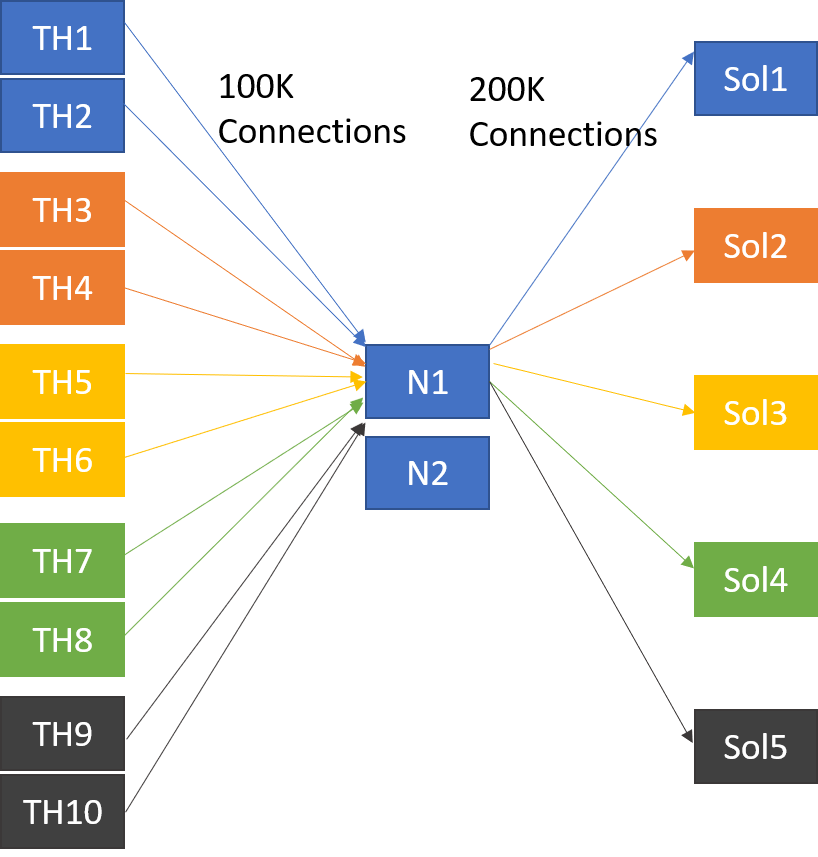

# Large Test (1 Million concurrently connected clients)

## Solace PubSub+ Broker 
### AWS Host
5 x m5a.4xlarge ca-central-1b
### Version
9.2.0.14 Evel
### Tuning
200K scaling tier
Each VMR has 4 internal IPs. Loadbalancer round-robin across 4 IPs the acheive 4x50K connections to beat 65K port limit.

## Test hosts
### AWS Host
10 x m5a.xlarge ca-central-1a
### Version
4.14.123-111.109.amzn2.x86_64 #1 SMP Mon Jun 10 19:37:57 UTC 2019

2 Test hosts each with 4 x 25K connections to give 200K connections per VMR.  After each 200K loaded the "default" seed for NGiNX moved to next VMR.

Example test tool 
Note here we have no traffic running, only connections
sudo ./connectChurn --cip=mqtt:172.31.11.210 --cu=vmr1-c1  --contexts=16 --sessions=25000 --start=250 --mr=0 --qos=0 --cleansession=1 --ka=50 --logintimeout=120

 ## NGiNX Plus
### AWS Host
2 X m5a.4xlarge ca-central-1b  seed and connections zone sync'd
### Version
1.15.10 , build:nginx-plus-r18-p1

### Tuning

seed keyval datastore:
curl -X POST http://localhost:80/api/4/stream/keyvals/mqtt_seed -d '{"default":"172.31.8.41:1883 172.31.4.117:1883 172.31.13.100:1883 172.31.11.149:1883"}'

See config files +

sysctl -p  
net.ipv4.ip_nonlocal_bind = 1 
net.ipv4.tcp_tw_reuse = 1 
echo 125020 > /proc/sys/kernel/threads-max 
echo 600000 > /proc/sys/vm/max_map_count 
echo 200000 > /proc/sys/kernel/pid_max 
 
##Raise the ability to handle more ports and FDs.  Current perf-hosts can handle 28K client connections, we can bump this to 65K per source address
/# Ref: https://mrotaru.wordpress.com/2013/10/10/scaling-to-12-million-concurrent-connections-how-migratorydata-did-it/ 
echo 1025 65500 > /proc/sys/net/ipv4/ip_local_port_range 
echo 3000000 > /proc/sys/fs/nr_open 
ulimit -n 2000000 

#sysctl -w net.netfilter.nf_conntrack_max=262144 
#echo 65536 > /sys/module/nf_conntrack/parameters/hashsize 
echo 6462164 > /proc/sys/fs/file-max 

/##Tune system for through-put not latency: 
tuned profile throughput-performance 

Up from 4K by editing : 
/etc/security/limits.d/20-nproc.conf 

Problem was within nginx itself, not linux.  Fix: 
worker_rlimit_nofile 150000; 

Local ports
https://ma.ttias.be/nginx-cannot-assign-requested-address-for-upstream/

https://gist.github.com/denji/8359866

https://stackoverflow.com/questions/3191509/nginx-error-99-cannot-assign-requested-address

Stall at 28K clients:
https://gryzli.info/2018/03/05/nginx-cannot-assign-requested-address/

Edit /etc/sysctl.conf  and add:
net.ipv4.tcp_tw_reuse=1
then issue:

1	sysctl -p 

From <https://gryzli.info/2018/03/05/nginx-cannot-assign-requested-address/> 
 sudo sysctl -w net.ipv4.ip_local_port_range="1024 65535"
